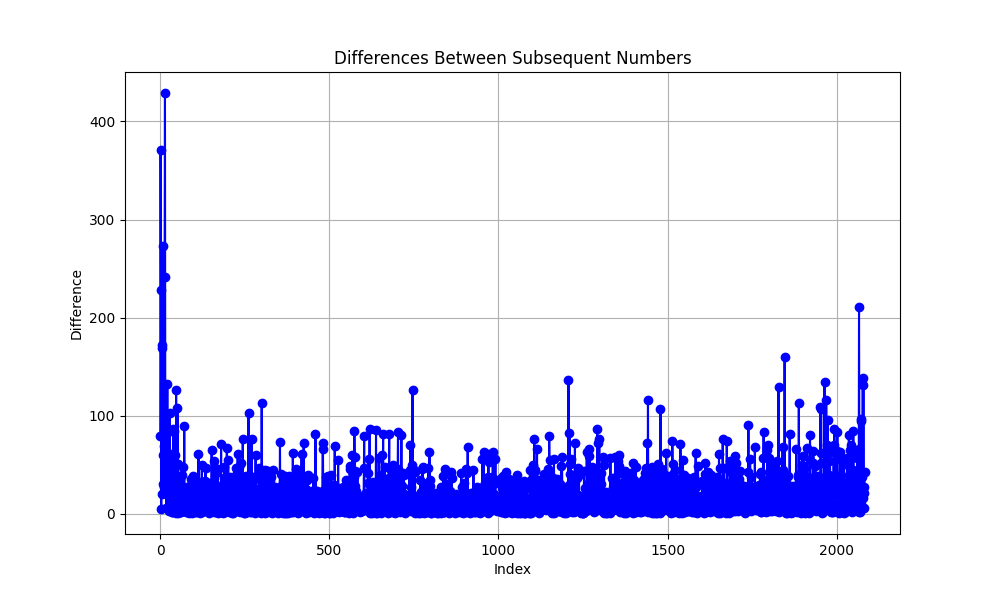
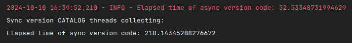
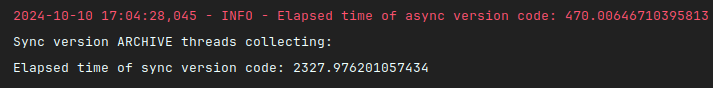

# 4chan_scraper

Entrypoing: main.py
Files config.json, main.py and functions.py should be in the same directory.

- In config.json file:
    - Set `folder_path` variable to directory, where saved threads will be stored
    - To run parsing from scratch set `last_archive_element` to 0, `archive_modified_date` and catalog_modified_date
      to `''` (empty string)

- Script save threads to separate files. File structure:
    - "title" - thread's title (empty string, if no title)
    - "text" - thread's text (empty string, if no text)
    - "img_link" - link to image in thread (empty string, if no image)
    - "replies" - list of comment to thread (empty, if no comments). Comment entity structure:
        - "text" - comment's text (empty string, if no text)
        - "img_link" - link to image in comment (empty string, if no image)

Update period is 1 hour. First run could be a little big longer cause of archive size (next run will be after 1 hour
after the end of update).

## Changelog

### Critical changes

+ There was a code in previous version like ```reply = requests.get(ARCHIVE).json()```.
  However, in the archive you can find IDs for which it is impossible to obtain thread content and comments. So thar
  raises exception and scraper stops collecting data from archive.
  In new version it was wrapped in try-except construction to avoid errors like this.

### Major changes

+ Added logger
+ In function ```cleanhtml``` was removed loop. Now the text is extracted via regular expressions. That changed
  complexity from ```O(n²)``` (because of ```.find```) to ```O(n)```
+ Added async task execution. Response is divided into several parts, turned into tasks and performed competitively. The
  number of tasks can be configured edited the ```TASKS_AMOUNT``` variable. Yep, it could be developed, using
  mutliprocessing, it's could be faster, but we scrape data just once an hour, so asyncio version should be less
  demanding on system resources.
+ In previous version we made request to each thread to define, was it changed or no since last check. So that is takes
  a lot of time. If we make request to ```https://a.4cdn.org/biz/threads.json```, we will be able to determine in one
  request which posts have changed since the last check.
+ Added ```aiofiles``` to save threads to files.
+ In function ```archive_rec``` was code like
    ```
    for i in range(len(reply) - 1, 0, -1):
            if reply[i] <= last_local_thread:
                dif = reply[i + 1:]
                break
    ```
  I collected all ids from archive and using ```check_archive_ids_difference_distribution.py``` script built a graph of
  the distribution of the difference between neighboring ids.
  
  The distribution turned out to be quite uniform so we can be sure, that if we will split unarchived threads id between
  workers, each worker will receive approximately the same number of ids for processing.

### Minor changes

+ In function ```get_text``` I added ```""``` as default value to return. Because it can return ```None``` and then
  raise an error

### Performance

+ Collecting from catalog became 4 times faster (53 sec. vs 218 sec.)
  
+ Collecting from archive became 5 times faster (470 sec. vs 2327 sec.)
   